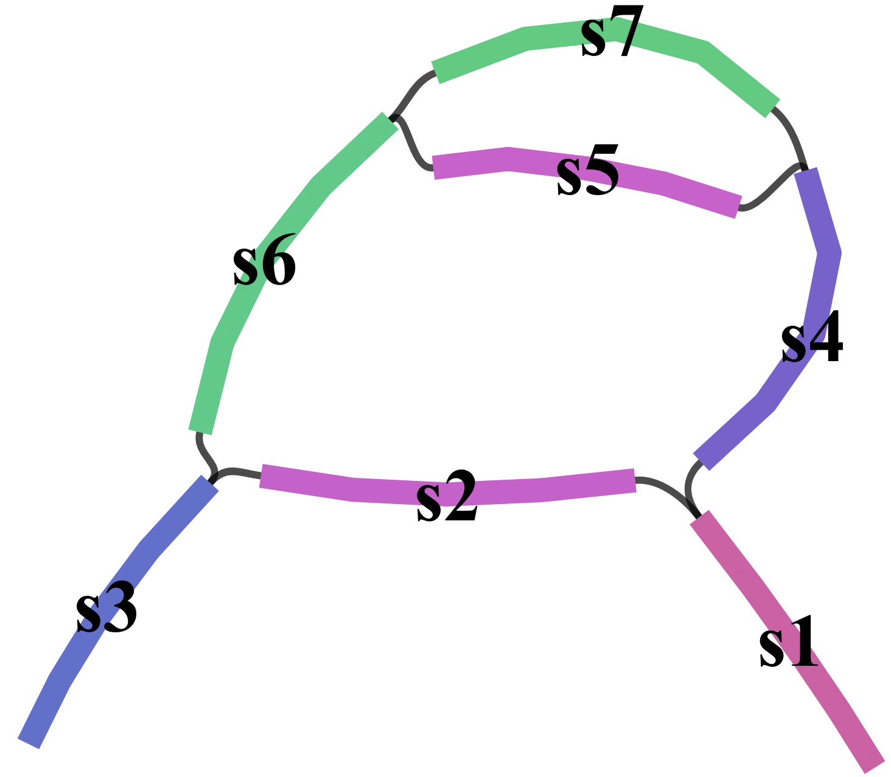

# Billi

Billi is a tool developed to identify bubbles in pangenome graphs or assembly graphs that use the [bidirected graph](https://en.wikipedia.org/wiki/Bidirected_graph) or [GFA](https://gfa-spec.github.io/GFA-spec/GFA1.html) representation. Refer to our [preprint](#pub) for details. 

## **Installation**

```
git clone https://github.com/at-cg/billi.git
cd billi/src
make 
# This will download CLI11.hpp file in your ~/include directory if missing
```
The binary will be saved in the bin folder.

## Usage
```
billi decompose -i <PATH_TO_GFA_FILE> -o <PATH_TO_THE_DIRECTORY_THAT_WILL_SAVE_THE_RESULTS> 
```
Check [here](docs/commands.md/#decompose) to see the command-line options. The output format is similar to [pangene](https://github.com/lh3/pangene/tree/main) but we only report the entrance edges along with the direction of traversal. 

The following files will be saved in the output directory:
```
summary.txt - This will list the summary of the input graph.
panbubble.txt - This will list the panbubbles.
hairpin.txt - This will list the hairpins. The user needs to use -r flag.
```

## Try Billi on small graph
```
billi decompose -i test/gfa_files/t2-1.gfa -r -o output_directory
```
<p align="center">
  
  <br>
  <em>Bandage visualisation of t2-1 test graph</em>
</p>

The graph contains two nested bubbles. Expect the following output:
```
<s6 <s4
>s1 >s3
```

See the [test folder](test/gfa_files) for other test cases.

## <a name="pub"></a>Preprint
- **Shreeharsha G Bhat, Daanish Mahajan and Chirag Jain**. Billi: Provably Accurate and Scalable Bubble Detection in Pangenome Graphs. *BioRxiv*
