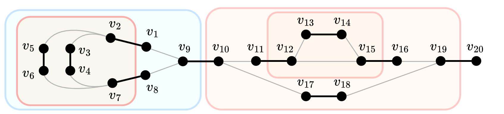
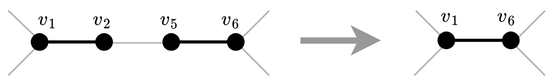
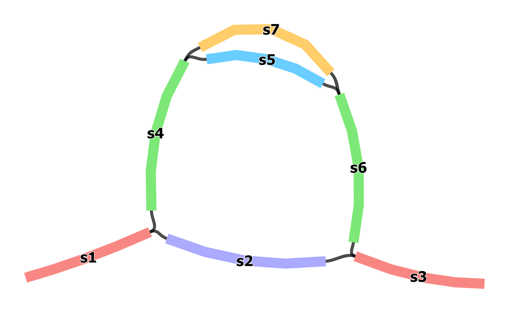

[](https://github.com/at-cg/billi/actions/workflows/test.yml)
[](https://github.com/at-cg/billi/tags)

# Billi

Billi is a tool designed to identify bubbles in a pangenome graph, represented in [GFA](https://gfa-spec.github.io/GFA-spec/GFA1.html) format. Billi employs updated definitions of bubbles, termed *panbubbles* and *hairpins*. These definitions apply to both cyclic and acyclic subgraphs, enabling broader coverage of variant classes. Panbubbles and hairpins are guaranteed to be mutually non-overlapping except in cases when they follow a nested structure. By definition, they exclude tip vertices (dead ends). Billi is scalable to large pangenome graphs, including the full human pangenome graphs released by the HPRC. These properties make Billi a useful alternative method for analyzing variation sites and alleles in pangenome graphs. See the [preprint](#citation) for further details.

<p align="center">
  
  <br>
  <em> Illustration of nested panbubbles and hairpins. Three panbubbles (red) and one hairpin (blue) are highlighted. </em>
</p>


## Table of Contents
- [Installation](#installation)
- [Dependencies](#dependencies)
- [Usage](#usage)
  - [Decompose](#decompose)
  - [Compact](#compact)
- [Example](#example)
- [Running the test suite](#running-the-test-suite)
- [Limitations](#limitations)
- [Citation](#citation)


## **Installation**
```bash
git clone https://github.com/at-cg/billi.git
cd billi
make 
```

## **Dependencies**
- **OS:** Linux
- **Compiler:** GCC version 8 or newer
- **Build tool:** `make`
- `python3`: only needed to run the test suite, not for normal builds/usage

## Usage
### Decompose
Enumerates all panbubbles and hairpins in the input graph. The graph is first compacted internally before bubble detection is performed.

```bash
./billi decompose -i inputgraph.gfa > out.txt 
```

### Compact
Merges long non-branching paths in the input graph into single vertices, producing a smaller, equivalent graph in the GFA format.
<p align="center">
  
  <br>
  <em> Visualisation of compaction operation</em>
</p>

```bash
./billi compact -i inputgraph.gfa -o compactgraph.gfa 
```

See [docs/commands.md](docs/commands.md) for the command-line options. 

## Example
```bash
./billi decompose -i test_files/edge_cases/nested.gfa > outputfile
```
<p align="center">
  
  <br>
  <em>Bandage visualisation of the nested.gfa test graph</em>
</p>

The graph (nested.gfa) contains two bubbles, one completely nested in another. 

**Expected output:**

The output format is similar to [pangene](https://github.com/lh3/pangene/tree/main).

```
CC	BB	bbID	bbDpt	parID	side1	side2	#alleles
CC	HP	bbID	side1	side2	#alleles
CC	AL	#hap	walk	hap_id
CC
BB	0	2	BB:1	<s6	<s4	-1
BB	1	1	-1	>s1	>s3	-1
```
- Every output starts with `CC` comment lines documenting column layout, followed by one row per panbubble/hairpin found.
- **`BB`** rows are panbubbles: `bbID` (unique ID), `bbDpt`: Depth of the bubble (`1` means top-level),`parID`: ID of the parent bubble (`-1` if top-level, or `BB:<id>`/`HP:<id>` if nested inside another panbubble/hairpin), `side1`/`side2` (the two boundary nodes, with `<`/`>` indicating the strand each is entered on), and `#alleles`.
- **`HP`** rows are hairpins: same fields as `BB`, minus `parID`.
- **`#alleles`** is `-1` when allele walks weren't computed (e.g. the input GFA has no `W`/`P` lines). When alleles are available, each one is listed on its own `AL` row directly under the corresponding `BB`/`HP` row, and the block is terminated with a `//` line.

Other test graphs are available in the [test folder](test_files). Our benchmark datasets are publicly available at: [https://doi.org/10.5281/zenodo.21104719](https://doi.org/10.5281/zenodo.21104719).

## Running the test suite
```bash
python3 src/test_script.py --binary ./billi --test-dir test_files --verbose
```
This is the same check run on every push/PR (see [.github/workflows/test.yml](.github/workflows/test.yml)).

## Limitations

- The code accepts only uncompressed GFA format. Other formats (e.g., `.gbz`, `.vg`) and compressed GFA files (`.gfa.gz`) are not supported.

- The algorithm assumes that every connected component of the input graph contains at least one tip vertex; otherwise, execution terminates with an error.

- The default heuristic approach for finding bubbles in Billi is significantly faster than the exact algorithm, but it may produce different output in certain edge cases.

- Printing alleles in every bubble can slow execution on large graphs. Use the `-w` flag to disable this feature.

- Code is currently compatible only with Linux OS.

## Citation
If you use Billi, please cite:

> Shreeharsha G Bhat, Daanish Mahajan, and Chirag Jain. Billi: Provably Accurate and Scalable Bubble Detection in Pangenome Graphs. *bioRxiv* (2025). https://doi.org/10.1101/2025.11.21.689636
